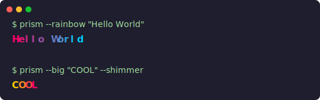

<p align="center">
  <h1>prism</h1>
  <p>Full-screen terminal visualizer. Any text, animated with light.</p>
  <a href="https://www.npmjs.com/package/@neocrev/prism"></a>
  <a href="LICENSE"></a>
</p>

<p align="center">
  
</p>

## Install

```bash
npm install @neocrev/prism
# or
npx @neocrev/prism "hello world" --wave
```

---

## Modes

| Flag | Effect |
|------|--------|
| `--wave` | Text undulates, colours flow through |
| `--drift` | Characters float like particles |
| `--aurora` | Slow shifting aurora glow |
| `--fire` | Warm flickering fire effect |
| `--rain` | Characters fall like rain |
| `--big` | Banner text with any effect |

Press any key to exit.

### Options

| Flag | Description |
|------|-------------|
| `--from "#ff0066"` | Start colour |
| `--to "#00ccff"` | End colour |
| `--speed 2` | Speed multiplier |
| `--preview` | Auto-exit after 5 seconds |

Pipe from stdin works too: `echo "text" \| npx @neocrev/prism --drift`

---

## Library

```js
import { gradient, animate, banner } from '@neocrev/prism';

// Static gradient
console.log(gradient('Hello', { colors: ['#ff0066', '#00ccff'] }));

// Animated
const anim = animate('Hello World', { mode: 'rainbow', fps: 30 });
setInterval(() => {
  process.stdout.write('\x1b[2J\x1b[H');
  process.stdout.write(anim.frame());
}, 33);

// Banner text
console.log(banner('PRISM'));
```

---

## License

MIT
